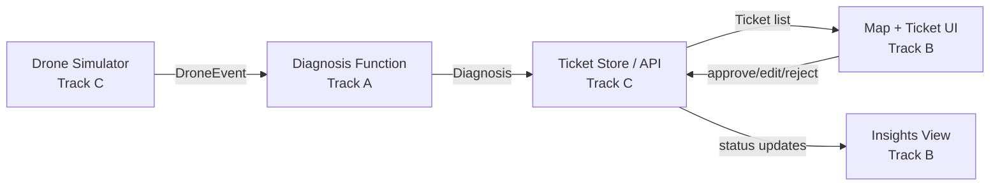

# FarmSentry — Project Specification

_(working title — rename freely)_

**One-liner:** AI-powered crop disease triage for NZ growers — autonomous drone scans flag problems on a map, an AI suggests diagnosis + treatment, the farmer approves/edits, and it becomes a to-do list.

**The differentiation line (say this if anyone mentions Taranis):**

> "Taranis is real, but it's built for a different farm — high-volume commodity row crops across thousands of acres in the US, Canada, Brazil, Argentina, Russia, Ukraine and Australia, priced at $5–20/acre/season with local offices and contracted agronomists. New Zealand isn't in their footprint and our crops aren't in their model. We're building for kiwifruit, apples, wine grapes, pasture — small, high-value blocks — not the corn belt."

---

## 1. Scope

### Building tonight (MVP)

- Simulated drone feed: fake GPS-tagged "scan events" with sample images, on a manual trigger
- AI diagnosis: image → condition + confidence + suggested treatment (vision-capable model, not a trained-from-scratch CV model)
- Map + ticket list showing every flagged issue
- Ticket detail view: AI diagnosis, farmer approve / edit / reject
- To-do list of approved actions, with a "mark complete" state
- Basic insights view: counts by status, by crop, by issue type

### Explicitly OUT of scope tonight (say this proactively, don't wait to be asked)

- **Real drone hardware or flight.** Simulated only.
- **Autonomous treatment application.** NZ CAA Part 102 requires a supervising human observer for any agrichemical drone flight regardless of "autonomy" — roadmap slide, never a live claim.
- **Live/online model learning from farmer corrections.** Frame as "logged for the next training run," not "learns in real time."
- **Full crop coverage.** Demo scoped to 2 crops — grape and apple, both real NZ export crops, both covered by the public PlantVillage dataset. State this confidently, don't apologize for it.

---

## 2. Tech Stack & Setup

- **Framework:** Next.js (App Router) + React + TypeScript — single repo, single deploy
- **Styling:** Tailwind
- **Data storage:** in-memory store or a local JSON file. Do NOT stand up a hosted database tonight.
- **Maps:** Leaflet + OpenStreetMap tiles — free, no API key
- **Hosting:** Vercel — connect the repo in the first 30 minutes so there's always a working deployed URL as a safety net

**Scaffold commands (run once, together, before splitting up):**

```bash
npx create-next-app@latest farmsentry --typescript --tailwind --app --eslint
cd farmsentry
npm install leaflet react-leaflet
npm install -D @types/leaflet
```

**.env.local:**

```
ANTHROPIC_API_KEY=your_key_here
# swap for OPENAI_API_KEY if using GPT-4V instead — Track A's choice, document whichever is used
```

---

## 3. Repo Structure

```
/app
  /api
    /tickets          <- Track C
    /drone            <- Track C
  /(dashboard)
    /map               <- Track B
    /tickets/[id]       <- Track B
    /insights           <- Track B
/lib
  /diagnosis            <- Track A (single exported function, no dependencies on the other two)
  /droneSimulator        <- Track C
  /treatments.json       <- Content library, see Section 6
  /types.ts             <- SHARED - do not edit without telling the other two
/data
  /sample-images         <- PlantVillage grape + apple subset
```

**Git workflow:** with 3 people in clearly separated folders and only a couple hours, skip feature branches and PRs — that's overhead you don't need. Work directly on `main`, commit and push every 15–20 minutes so conflicts stay small, and shout in the group chat before touching `types.ts` or anything outside your own folder.

---

## 4. Shared Data Contracts

**Lock these before anyone starts coding.**

```ts
// lib/types.ts

type CropType = "grape" | "apple";

interface DroneEvent {
  id: string;
  timestamp: string; // ISO 8601
  lat: number;
  lng: number;
  imageUrl: string;
  cropType: CropType;
}

interface Diagnosis {
  condition: string; // e.g. "Grape Black Rot" or "Healthy"
  confidence: number; // 0-1
  suggestedTreatment: string;
}

interface Ticket {
  id: string;
  droneEventId: string;
  lat: number;
  lng: number;
  imageUrl: string;
  cropType: CropType;
  diagnosis: Diagnosis;
  status: "new" | "approved" | "edited" | "rejected" | "completed";
  farmerNotes?: string;
  assignedTo: "farmer" | "drone" | null;
  createdAt: string;
  updatedAt: string;
}
```

---

## 5. Architecture



---

## 6. Disease & Treatment Content Library

General horticultural guidance for demo purposes — in the pitch, frame this as triage guidance the farmer verifies, not a registered chemical prescription. Paste directly into `lib/treatments.json`.

**Grape**
| Condition | Symptoms | General response |
|---|---|---|
| Black Rot | Reddish-brown circular leaf spots with dark margins; berries shrivel into black "mummies" | Remove and destroy mummified berries, improve canopy airflow via leaf pulling, protectant fungicide during wet spring growth |
| Esca (Black Measles) | Interveinal "tiger-stripe" leaf streaking, dark berry spotting, occasional sudden vine collapse | No curative spray — preventive only: avoid pruning in wet weather, protect large cuts, remove severely affected vines |
| Leaf Blight (Isariopsis Leaf Spot) | Angular brown necrotic lesions, early defoliation | Sanitation (remove fallen leaves), improve airflow, protectant fungicide in humid periods |
| Healthy | No visible symptoms | No action — log for insights baseline |

**Apple**
| Condition | Symptoms | General response |
|---|---|---|
| Apple Scab | Olive-green to black velvety spots on leaves/fruit, fruit russeting | Rake and destroy fallen leaves, protectant fungicide from green tip through early summer, resistant cultivars long-term |
| Black Rot (Frogeye Leaf Spot) | Purple-bordered "frogeye" leaf spots, fruit rot with concentric rings, branch cankers | Prune out cankers and dead wood, remove mummified fruit, protectant fungicide |
| Cedar Apple Rust | Bright orange-yellow leaf spots (needs a nearby juniper/cedar host) | Remove nearby host junipers if feasible, protectant fungicide in spring, resistant cultivars long-term |
| Healthy | No visible symptoms | No action — log for insightss baseline |

---

## 7. Design System

Grounded in the actual subject — a vineyard survey instrument, not a generic SaaS dashboard. Avoid the default "cream background + serif" or "black + neon accent" AI-app looks; this palette comes from the vineyard itself (canopy, soil, ripening fruit) and the map/telemetry context, not a template.

**Color**
| Token | Hex | Use |
|---|---|---|
| `--mist-50` | `#EDF0EA` | Page background — pale sage, cool undertone, evokes morning mist over the rows |
| `--canopy-900` | `#1C2E22` | Body text |
| `--canopy-600` | `#3F6B48` | Primary actions, nav, "healthy/completed" status |
| `--soil-500` | `#8C5A34` | Secondary/grounding — dividers, footer, used sparingly |
| `--veraison-500` | `#D98E3B` | "New/needs review" status — named for the color grapes turn as they ripen |
| `--alert-600` | `#A6402F` | "Disease flagged/urgent" status — a muted brick-red, not a stock UI red |

**Type**

- Display + body: **IBM Plex Sans** (SemiBold for headers, Regular for body) — technical but warm, not the generic Inter-only default
- Data/utility: **IBM Plex Mono** — for GPS coordinates, confidence scores, ticket IDs, timestamps. This isn't decorative: it's functionally justified by the content (a drone telemetry feed genuinely reads like monospaced instrument data), and it ties the UI's voice to what it's actually showing.

**Layout**

- Top bar: small wordmark styled like a system readout, e.g. `FARMSENTRY // RENWICK-01` in Plex Mono, plus live pill counts for new/approved/completed
- Main view: full-bleed map, pins colored by status (`veraison` = new, `canopy` = approved/completed, `alert` = flagged urgent). Persistent "Trigger Scan" button, bottom-right, styled like a physical instrument button, not a generic rounded CTA
- Ticket detail: a **side panel that slides in from the right**, not a modal — keep the map visible behind it so the pin and its ticket stay spatially connected. This is a small, deliberate choice: most CRUD hackathon apps default to a blocking modal, and it costs nothing extra to do the panel instead
- Insights: a row of stat cards using Plex Mono numerals (data-first, "readout" feel) plus one bar chart in the canopy/veraison palette

**Signature moment:** when "Trigger Scan" fires, the new pin lands with a single concentric-ring ping animation in `--veraison-500` — one orchestrated moment, not scattered micro-animations everywhere else. This is the one place to spend design effort; keep the rest quiet and disciplined.

---

## 8. TRACK A — AI Diagnosis Layer

**Owner:** _[fill in]_
**Goal:** one function. `diagnose(imageUrl: string, cropType: CropType): Promise<Diagnosis>`

**Tasks:**

1. Pull ~15–20 sample images per crop from PlantVillage (grape: black rot, esca, leaf blight, healthy; apple: scab, black rot, cedar apple rust, healthy). Drop into `/data/sample-images`.
2. Write `diagnose()` in `/lib/diagnosis`. Call a vision-capable model with the image, asking for condition + confidence + a treatment pointer, returned as strict JSON. Cross-reference against Section 6's content library for the treatment text rather than trusting the model's free-form suggestion — more consistent, and matches what's in `treatments.json`.
3. Pre-compute and cache the diagnosis result for every image that will actually appear in the live demo sequence (see Section 11 — this is your contribution to demo resilience).
4. Write 3–5 test calls proving `diagnose()` returns sane output for each condition. Keep the logs — useful in the pitch as "here's the model catching X."

**Definition of done:** `diagnose()` is a pure function Track C can import and call with zero setup on their end.

---

## 9. TRACK B — Frontend / App

**Owner:** _[fill in]_
**Goal:** everything the farmer (and the judges) actually see and click. Build against Section 7's design system.

**Tasks:**

1. **Map view** — Leaflet + OSM tiles, pins colored per Section 7. Clicking a pin opens the side panel (not a modal).
2. **Drone animation** — icon moving along the Section-13 waypoint path, manual "Trigger Scan" button that fires the next event and animates the ping (Section 7's signature moment). Build the manual trigger first — never depend on an automatic timer during a live demo.
3. **Ticket side panel** — image, AI diagnosis, confidence, suggested treatment, Approve / Edit / Reject. Rejected/edited tickets let the farmer type a correction.
4. **To-do list** — approved tickets, grouped by "assigned to farmer" vs "assigned to drone" (drone tasks are visibly roadmap-flagged, not functional). Mark-complete checkbox.
5. **Insights view** — stat cards + one bar chart per Section 7. Don't overbuild this one.

**Definition of done:** trigger scan → pin + ping → open panel → approve → item in to-do list → mark complete → insights update, working end to end, using mock data if Track C isn't ready yet.

---

## 10. TRACK C — Backend / API + Drone Simulator

**Owner:** _[fill in]_
**Goal:** the plumbing that connects A and B.

**Tasks:**

1. **Drone simulator** (`/lib/droneSimulator`) — see Section 13 for the exact waypoint array. `getNextEvent()` cycles through waypoints and sample images, weighted ~40% disease / 60% healthy.
2. **API routes:**
   - `POST /api/drone/trigger` — pulls the next `DroneEvent`, calls Track A's `diagnose()`, creates a `Ticket`, stores it, returns it
   - `GET /api/tickets` — list all tickets
   - `PATCH /api/tickets/:id` — update status/farmerNotes
3. **Storage** — in-memory array or local JSON file.
4. **Seed data** — pre-populate 5–8 tickets at startup so the map isn't empty before the first live trigger.

**Definition of done:** Track B can hit these three endpoints and get exactly the shapes in `lib/types.ts`, with zero knowledge of how the simulator or AI call works internally.

---

## 11. Demo Resilience — Failure Fallbacks

- **AI call fails or is slow (>3s) live:** fall back instantly to Track A's pre-cached response for that exact image (Section 8, task 3). The system genuinely calls the live model first — the cache is a safety net, not a fake result.
- **Venue wifi drops:** demo from `localhost`, not the Vercel URL. Deployed URL is the backup for judges to explore afterward, not the primary vehicle. Keep a static screenshot of the map view as an absolute last resort if the laptop itself has issues.
- **Map tiles won't load:** have one cached/offline tile set or a static map image ready as a fallback background.
- **Live demo dies completely:** 2–3 screenshots of the full working flow, saved to the pitch deck, so total technical failure doesn't kill the narrative.
- **One person drives, live, on stage.** The other two watch for bugs — don't let the presenter debug and pitch at the same time.

---

## 12. Integration Timeline

| Checkpoint    | What happens                                                                          |
| ------------- | ------------------------------------------------------------------------------------- |
| Now           | All three confirm `types.ts`, no debate after this point                              |
| Early         | Build independently against the contract, mock data where needed                      |
| Mid           | First integration check — wire real endpoints together, fix mismatches                |
| Late          | Feature complete, seed data in, insights working, cached fallbacks in place           |
| Final stretch | Rehearse the demo click-path 2–3 times, not more — polish stops paying off after that |

---

## 13. Demo Flight Path — Renwick, Marlborough

Real coordinates, the centre of NZ's Sauvignon Blanc growing region.

```ts
// Demo flight path — Renwick, Marlborough (heart of NZ's grape-growing region)
export const DEMO_WAYPOINTS: { lat: number; lng: number }[] = [
  { lat: -41.507, lng: 173.826 },
  { lat: -41.507, lng: 173.83 },
  { lat: -41.507, lng: 173.834 },
  { lat: -41.5095, lng: 173.834 },
  { lat: -41.5095, lng: 173.83 },
  { lat: -41.5095, lng: 173.826 },
  { lat: -41.512, lng: 173.826 },
  { lat: -41.512, lng: 173.83 },
  { lat: -41.512, lng: 173.834 },
];

export const DEMO_FARM_CENTER = { lat: -41.5095, lng: 173.83 };
```

---

## 14. Demo Script (rehearse this exact path)

1. One-liner + the Taranis differentiation line
2. Show the map with pre-seeded tickets — "here's a farm mid-scan"
3. Click "Trigger Scan" — drone animates, new pin drops in with the ping
4. Open the panel — AI diagnosis + confidence + suggested treatment
5. Approve it — show it land in the to-do list
6. Mark it complete — show insights update
7. Close on the roadmap slide: real drone hardware, autonomous treatment (CAA Part 102 line ready if asked), kauri dieback/biosecurity as a phase-2 government application of the same pipeline

## 15. If a judge pushes on limitations, say this (don't dodge)

- **"Is it really autonomous?"** → "CAA Part 102 requires a supervising observer for any agrichemical flight today — what we automate is the scheduling and detection, not the legal oversight requirement."
- **"How accurate is early detection from the air?"** → "Published research shows lab accuracy above 95% degrades meaningfully in field conditions — we're honest that this is a triage and prioritization tool, surfacing the highest-risk areas for a human to check, not a diagnostic replacement for one."
- **"Why not just use Taranis?"** → the differentiation line at the top of this doc.
