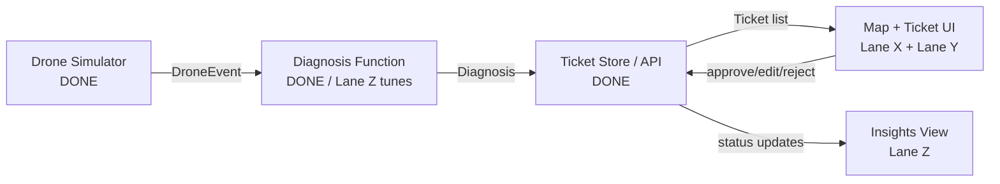

# CropIQ — Project Specification

_(working title — rename freely)_

**One-liner:** AI-powered crop disease triage for NZ growers — autonomous drone scans flag problems on a map, an AI suggests diagnosis + treatment, the farmer approves/edits, and it becomes a to-do list.

**The differentiation line (say this if anyone mentions Taranis):**

> "Taranis is real, but it's built for a different farm — high-volume commodity row crops across thousands of acres in the US, Canada, Brazil, Argentina, Russia, Ukraine and Australia, priced at $5–20/acre/season with local offices and contracted agronomists. New Zealand isn't in their footprint and our crops aren't in their model. We're building for kiwifruit, apples, wine grapes, pasture — small, high-value blocks — not the corn belt."

---

## 0. Status — read this before anything else

**The scaffold, the shared contracts and the whole backend are already built and pushed to `main`.** Clone, `npm install`, and you can start on your lane immediately. Nobody is blocked on anybody.

### Already done ✅

| Path | What it is |
| --- | --- |
| `lib/types.ts` | Shared contract (Section 4). **Frozen** — shout in the chat before editing |
| `lib/treatments.json` | Section 6 disease + treatment content library |
| `lib/diagnosis/` | `diagnose(imageUrl, cropType)` — live model call, 3s timeout, cached fallback |
| `lib/droneSimulator/` | `DEMO_WAYPOINTS` (Renwick) + `getNextEvent()`, ~40/60 disease/healthy, deterministic |
| `lib/store.ts` | In-memory ticket store |
| `lib/seed.ts` | 7 pre-seeded tickets so the map isn't empty on stage |
| `app/api/` | All three endpoints, verified working (Section 10) |
| `app/globals.css` | Section 7 palette, IBM Plex Sans/Mono, `.pin-ping` keyframes |
| `public/sample-images/` | 14 **placeholder** SVGs — Lane Z replaces them |

### Left to build — three lanes, one person each

| Lane | Owns | Section |
| --- | --- | --- |
| **Lane X** | Map view, pins, Trigger Scan, drone animation | Section 8 |
| **Lane Y** | Ticket side panel, approve/edit/reject, to-do list | Section 9 |
| **Lane Z** | Real PlantVillage images, AI verification, insights view | Section 10 |

Say this in the group chat and start: _"X takes the map, Y takes the panel and to-do, Z takes the images and insights."_

### Unassigned, do it in the first 15 minutes

Connect the repo to Vercel so there's always a deployed URL as a safety net (Section 2). Whoever is free.

---

## 1. Scope

### Building tonight (MVP)

- Simulated drone feed: fake GPS-tagged "scan events" with sample images, on a manual trigger
- AI diagnosis: image → condition + confidence + suggested treatment (vision-capable model, not a trained-from-scratch CV model)
- Map + ticket list showing every flagged issue
- Ticket detail view: AI diagnosis, farmer approve / edit / reject
- To-do list of approved actions, with a "mark complete" state
- Basic insights view: counts by status, by crop, by issue type

### Explicitly OUT of scope tonight (say this proactively, don't wait to be asked)

- **Real drone hardware or flight.** Simulated only.
- **Autonomous treatment application.** NZ CAA Part 102 requires a supervising human observer for any agrichemical drone flight regardless of "autonomy" — roadmap slide, never a live claim.
- **Live/online model learning from farmer corrections.** Frame as "logged for the next training run," not "learns in real time."
- **Full crop coverage.** Demo scoped to 2 crops — grape and apple, both real NZ export crops, both covered by the public PlantVillage dataset. State this confidently, don't apologize for it.

---

## 2. Tech Stack & Setup

- **Framework:** Next.js (App Router) + React + TypeScript — single repo, single deploy
- **Styling:** Tailwind
- **Data storage:** in-memory store or a local JSON file. Do NOT stand up a hosted database tonight.
- **Maps:** Leaflet + OpenStreetMap tiles — free, no API key
- **Hosting:** Vercel — connect the repo in the first 30 minutes so there's always a working deployed URL as a safety net

**Getting running — the scaffold is already done, this is all you need:**

```bash
git clone https://github.com/IceBear-2000/AUT-AI-Hackthon.git
cd AUT-AI-Hackthon
npm install
cp .env.example .env.local   # paste the shared ANTHROPIC_API_KEY in
npm run dev
```

Installed already: Next.js 16, React 19, TypeScript, Tailwind v4, `leaflet` + `react-leaflet`, `@anthropic-ai/sdk`.

**No API key?** The app still runs. `diagnose()` falls back to the pre-cached results in `lib/diagnosis/cache.json`, so Lanes X and Y are never blocked waiting on a key.

---

## 3. Repo Structure

Every file below is owned by exactly one lane. **Stay in your own rows and you will never hit a merge conflict.**

```
/app
  /api
    /drone/trigger/route.ts     DONE - frozen
    /tickets/route.ts           DONE - frozen
    /tickets/[id]/route.ts      DONE - frozen
  /(dashboard)
    /map/page.tsx               <- LANE X  (currently a placeholder, delete it)
    /todo/page.tsx              <- LANE Y  (create)
    /insights/page.tsx          <- LANE Z  (create)
  globals.css                   DONE - shout before editing, it's shared
  layout.tsx                    DONE - shout before editing, it's shared
/components                     <- create this folder
  MapView.tsx                   <- LANE X
  TriggerScanButton.tsx         <- LANE X
  TicketPanel.tsx               <- LANE Y
/lib
  types.ts                      DONE - FROZEN, shout before editing
  treatments.json               DONE
  store.ts  seed.ts             DONE - frozen
  /diagnosis/index.ts           DONE  (Lane Z removes the SVG guard)
  /diagnosis/cache.json         <- LANE Z re-records
  /droneSimulator/index.ts      DONE  (Lane Z updates image filenames only)
/public
  /sample-images                <- LANE Z replaces all 14 files
```

**Git workflow:** with 3 people in clearly separated files and only a couple hours, skip feature branches and PRs — that's overhead you don't need. Work directly on `main`. `git pull --rebase` then push every 15–20 minutes so conflicts stay small, and shout in the group chat before touching `lib/types.ts`, `app/globals.css`, `app/layout.tsx`, or anything outside your own lane.

---

## 4. Shared Data Contracts

**Lock these before anyone starts coding.**

```ts
// lib/types.ts

type CropType = "grape" | "apple";

interface DroneEvent {
  id: string;
  timestamp: string; // ISO 8601
  lat: number;
  lng: number;
  imageUrl: string;
  cropType: CropType;
}

interface Diagnosis {
  condition: string; // e.g. "Grape Black Rot" or "Healthy"
  confidence: number; // 0-1
  suggestedTreatment: string;
}

interface Ticket {
  id: string;
  droneEventId: string;
  lat: number;
  lng: number;
  imageUrl: string;
  cropType: CropType;
  diagnosis: Diagnosis;
  status: "new" | "approved" | "edited" | "rejected" | "completed";
  farmerNotes?: string;
  assignedTo: "farmer" | "drone" | null;
  createdAt: string;
  updatedAt: string;
}
```

---

## 5. Architecture



---

## 6. Disease & Treatment Content Library

General horticultural guidance for demo purposes — in the pitch, frame this as triage guidance the farmer verifies, not a registered chemical prescription. Paste directly into `lib/treatments.json`.

**Grape**
| Condition | Symptoms | General response |
|---|---|---|
| Black Rot | Reddish-brown circular leaf spots with dark margins; berries shrivel into black "mummies" | Remove and destroy mummified berries, improve canopy airflow via leaf pulling, protectant fungicide during wet spring growth |
| Esca (Black Measles) | Interveinal "tiger-stripe" leaf streaking, dark berry spotting, occasional sudden vine collapse | No curative spray — preventive only: avoid pruning in wet weather, protect large cuts, remove severely affected vines |
| Leaf Blight (Isariopsis Leaf Spot) | Angular brown necrotic lesions, early defoliation | Sanitation (remove fallen leaves), improve airflow, protectant fungicide in humid periods |
| Healthy | No visible symptoms | No action — log for insights baseline |

**Apple**
| Condition | Symptoms | General response |
|---|---|---|
| Apple Scab | Olive-green to black velvety spots on leaves/fruit, fruit russeting | Rake and destroy fallen leaves, protectant fungicide from green tip through early summer, resistant cultivars long-term |
| Black Rot (Frogeye Leaf Spot) | Purple-bordered "frogeye" leaf spots, fruit rot with concentric rings, branch cankers | Prune out cankers and dead wood, remove mummified fruit, protectant fungicide |
| Cedar Apple Rust | Bright orange-yellow leaf spots (needs a nearby juniper/cedar host) | Remove nearby host junipers if feasible, protectant fungicide in spring, resistant cultivars long-term |
| Healthy | No visible symptoms | No action — log for insightss baseline |

---

## 7. Design System

Grounded in the actual subject — a vineyard survey instrument, not a generic SaaS dashboard. Avoid the default "cream background + serif" or "black + neon accent" AI-app looks; this palette comes from the vineyard itself (canopy, soil, ripening fruit) and the map/telemetry context, not a template.

**Color**
| Token | Hex | Use |
|---|---|---|
| `--mist-50` | `#EDF0EA` | Page background — pale sage, cool undertone, evokes morning mist over the rows |
| `--canopy-900` | `#1C2E22` | Body text |
| `--canopy-600` | `#3F6B48` | Primary actions, nav, "healthy/completed" status |
| `--soil-500` | `#8C5A34` | Secondary/grounding — dividers, footer, used sparingly |
| `--veraison-500` | `#D98E3B` | "New/needs review" status — named for the color grapes turn as they ripen |
| `--alert-600` | `#A6402F` | "Disease flagged/urgent" status — a muted brick-red, not a stock UI red |

**Type**

- Display + body: **IBM Plex Sans** (SemiBold for headers, Regular for body) — technical but warm, not the generic Inter-only default
- Data/utility: **IBM Plex Mono** — for GPS coordinates, confidence scores, ticket IDs, timestamps. This isn't decorative: it's functionally justified by the content (a drone telemetry feed genuinely reads like monospaced instrument data), and it ties the UI's voice to what it's actually showing.

**Layout**

- Top bar: small wordmark styled like a system readout, e.g. `CROPIQ // RENWICK-01` in Plex Mono, plus live pill counts for new/approved/completed
- Main view: full-bleed map, pins colored by status (`veraison` = new, `canopy` = approved/completed, `alert` = flagged urgent). Persistent "Trigger Scan" button, bottom-right, styled like a physical instrument button, not a generic rounded CTA
- Ticket detail: a **side panel that slides in from the right**, not a modal — keep the map visible behind it so the pin and its ticket stay spatially connected. This is a small, deliberate choice: most CRUD hackathon apps default to a blocking modal, and it costs nothing extra to do the panel instead
- Insights: a row of stat cards using Plex Mono numerals (data-first, "readout" feel) plus one bar chart in the canopy/veraison palette

**Signature moment:** when "Trigger Scan" fires, the new pin lands with a single concentric-ring ping animation in `--veraison-500` — one orchestrated moment, not scattered micro-animations everywhere else. This is the one place to spend design effort; keep the rest quiet and disciplined.

---

## 8. LANE X — Map & Live Scan

**Owner:** _[fill in]_
**Owns:** `app/(dashboard)/map/page.tsx`, `components/MapView.tsx`, `components/TriggerScanButton.tsx`
**Goal:** the screen the judges stare at for the whole demo. Build against Section 7.

**Tasks:**

1. **Delete the placeholder** currently in `app/(dashboard)/map/page.tsx` and replace it with a full-bleed Leaflet + OSM map, centred on `DEMO_FARM_CENTER`, zoom ~15.
2. **Pins** — `GET /api/tickets` on load, one pin per ticket, coloured by status per Section 7 (`veraison` = new, `canopy` = approved/completed, `alert` = disease flagged). Clicking a pin selects that ticket.
3. **Trigger Scan button** — bottom-right, styled like a physical instrument button, not a generic rounded CTA. `POST /api/drone/trigger` → append the returned ticket → drop its pin. **Manual trigger only, never an automatic timer during a live demo.**
4. **Signature moment** — the new pin lands with one concentric-ring ping in `--veraison-500`. The `.pin-ping` keyframes are already in `app/globals.css`, just apply the class.
5. **Drone icon** — sits on `DEMO_WAYPOINTS[droneWaypointIndex]`, which the trigger response already returns. Animate it moving between waypoints.

**Handoff to Lane Y:** when a pin is clicked, render `<TicketPanel ticket={selected} onClose={...} onUpdated={...} />`. Until Lane Y pushes that component, stub it with a plain `<div>{ticket.id}</div>` — do not wait.

**Notes:** `react-leaflet` must be client-only — `"use client"` plus `dynamic(() => import(...), { ssr: false })`. Leaflet's default marker icons break under bundlers, so use `CircleMarker` or `L.divIcon`, not the default marker.

**Definition of done:** trigger scan → new pin drops with the ping → clicking any pin fires the selection. Works on a cold reload.

---

## 9. LANE Y — Ticket Panel & To-Do List

**Owner:** _[fill in]_
**Owns:** `components/TicketPanel.tsx`, `app/(dashboard)/todo/page.tsx`
**Goal:** the approve/act loop — where the farmer is actually in charge, which is the whole pitch.

**Tasks:**

1. **Ticket panel** — a **side panel that slides in from the right, not a modal.** Keep the map visible behind it so the pin and its ticket stay spatially connected. Shows the image, condition, confidence and suggested treatment (confidence and ticket ID in Plex Mono).
2. **Approve / Edit / Reject** — `PATCH /api/tickets/:id` with `{"status": "approved" | "edited" | "rejected"}`. Edit and Reject open a textarea that writes to `farmerNotes` in the same PATCH.
3. **To-do list** at `/todo` — approved tickets grouped by `assignedTo: "farmer"` vs `assignedTo: "drone"`. The drone group is visibly roadmap-flagged and non-functional — that honesty is a pitch asset, not a weakness (Section 15).
4. **Mark complete** — checkbox → `PATCH` with `{"status": "completed"}`.

**Start immediately, zero dependencies.** `GET /api/tickets` already returns 7 seeded tickets. Build the panel standalone at `/todo` first; Lane X wires it into the map when both are ready.

**Definition of done:** approve a ticket → it appears in the to-do list → mark it complete → the status survives a page reload.

---

## 10. LANE Z — Real Images, AI Verification & Insights

**Owner:** _[fill in]_
**Owns:** `public/sample-images/`, `lib/diagnosis/cache.json`, `app/(dashboard)/insights/page.tsx`
**Goal:** make the AI claim real, and prove it on screen.

**Tasks:**

1. **Real images** — pull ~15–20 PlantVillage images per crop (grape: black rot, esca, leaf blight, healthy; apple: scab, black rot, cedar apple rust, healthy) into `public/sample-images/`, replacing the 14 placeholder SVGs. Keep the existing filenames, or update the image arrays in `lib/droneSimulator/index.ts` to match.
2. **Switch the live model on** — `lib/diagnosis/index.ts` deliberately throws on `.svg` so the placeholders never hit the API. Delete that guard once real `.jpg`/`.png` files are in.
3. **Verify** — run `diagnose()` against each of the 8 conditions and confirm the JSON is sane. Keep the logs; "here's the model catching esca" is a strong pitch beat.
4. **Re-record the cache** — `lib/diagnosis/cache.json` must have an entry for every image that can appear in the demo sequence. This is the Section 11 safety net; the live call still runs first.
5. **Insights view** at `/insights` — stat cards with Plex Mono numerals plus one bar chart, counts by status / crop / condition off `GET /api/tickets`. **Don't overbuild this one.**

**Definition of done:** live `diagnose()` returns correct conditions for all 8 classes, every demo image has a cache entry, and insights updates after a ticket is marked complete.

---

## 11. Demo Resilience — Failure Fallbacks

- **AI call fails or is slow (>3s) live:** already handled in code — `diagnose()` races the live call against a 3s timeout and falls back to Lane Z's pre-cached response for that exact image (Section 10, task 4). The system genuinely calls the live model first — the cache is a safety net, not a fake result.
- **Venue wifi drops:** demo from `localhost`, not the Vercel URL. Deployed URL is the backup for judges to explore afterward, not the primary vehicle. Keep a static screenshot of the map view as an absolute last resort if the laptop itself has issues.
- **Map tiles won't load:** have one cached/offline tile set or a static map image ready as a fallback background.
- **Live demo dies completely:** 2–3 screenshots of the full working flow, saved to the pitch deck, so total technical failure doesn't kill the narrative.
- **One person drives, live, on stage.** The other two watch for bugs — don't let the presenter debug and pitch at the same time.

---

## 12. Integration Timeline

| Checkpoint    | What happens                                                                                                     |
| ------------- | ---------------------------------------------------------------------------------------------------------------- |
| Now           | Everyone clones, `npm install`, reads `lib/types.ts`, claims a lane. No debate after this point                  |
| +15 min       | Vercel connected. Everyone has pushed at least one commit, so we know push access works                          |
| Early         | Lanes run independently — X against the seeded tickets, Y standalone at `/todo`, Z against real images           |
| Mid           | First integration check — Lane X wires in Lane Y's `TicketPanel`, replacing the stub                             |
| Late          | Feature complete: full click-path works, real images in, cache re-recorded, insights live                        |
| Final stretch | Rehearse the demo click-path 2–3 times, not more — polish stops paying off after that                            |

---

## 13. Demo Flight Path — Renwick, Marlborough

Real coordinates, the centre of NZ's Sauvignon Blanc growing region.

```ts
// Demo flight path — Renwick, Marlborough (heart of NZ's grape-growing region)
export const DEMO_WAYPOINTS: { lat: number; lng: number }[] = [
  { lat: -41.507, lng: 173.826 },
  { lat: -41.507, lng: 173.83 },
  { lat: -41.507, lng: 173.834 },
  { lat: -41.5095, lng: 173.834 },
  { lat: -41.5095, lng: 173.83 },
  { lat: -41.5095, lng: 173.826 },
  { lat: -41.512, lng: 173.826 },
  { lat: -41.512, lng: 173.83 },
  { lat: -41.512, lng: 173.834 },
];

export const DEMO_FARM_CENTER = { lat: -41.5095, lng: 173.83 };
```

---

## 14. Demo Script (rehearse this exact path)

1. One-liner + the Taranis differentiation line
2. Show the map with pre-seeded tickets — "here's a farm mid-scan"
3. Click "Trigger Scan" — drone animates, new pin drops in with the ping
4. Open the panel — AI diagnosis + confidence + suggested treatment
5. Approve it — show it land in the to-do list
6. Mark it complete — show insights update
7. Close on the roadmap slide: real drone hardware, autonomous treatment (CAA Part 102 line ready if asked), kauri dieback/biosecurity as a phase-2 government application of the same pipeline

## 15. If a judge pushes on limitations, say this (don't dodge)

- **"Is it really autonomous?"** → "CAA Part 102 requires a supervising observer for any agrichemical flight today — what we automate is the scheduling and detection, not the legal oversight requirement."
- **"How accurate is early detection from the air?"** → "Published research shows lab accuracy above 95% degrades meaningfully in field conditions — we're honest that this is a triage and prioritization tool, surfacing the highest-risk areas for a human to check, not a diagnostic replacement for one."
- **"Why not just use Taranis?"** → the differentiation line at the top of this doc.
